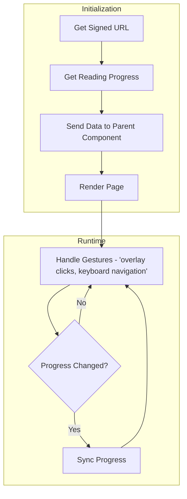

# PDF Rendering

This doc explains the changes involved in following commits:

[Rendering EPUB and syncing progress](https://github.com/Calcifer077/lumina-reader/tree/930044e0eda1f371b9cedef2dd9b79167797092c)

## Introduction

We fetched signed url from supabase of our epub file and rendered it using `react-reader`. Than we have used route handlers (will remove them in next commit) to sync progress for reading history.

## Getting Data for view

### Create signed URL

We will send a link to our frontend, our frontend will fetch that link and render the pdf.

As our supabase bucket is private, we can't directly access the files, we have to create something called a signed url. Signed url will be created by supabase and comes with a expiration time.

```ts
// _lib/books
export async function getSignedUrlForBook(id: string): Promise<string | null> {
  const [data] = await db
    .select({ filePath: books.file_path })
    .from(books)
    .where(eq(books.id, id));

  const filePath = data.filePath;

  const { data: dataFromStorage, error } = await supabase.storage
    .from("books")
    .createSignedUrl(filePath, 60 * 60); // expire in 1 hour

  if (error) return null;

  return dataFromStorage?.signedUrl;
}
```

### Get progress

Get progress for book.

```ts
// _lib/progress
export async function getProgress(bookId: string): Promise<ReadingProgress> {
  const [data] = await db
    .select()
    .from(readingProgress)
    .where(eq(readingProgress.book_id, bookId));

  return data;
}
```

If the data is not present (user never read the book), `data` will be null which is handled in frontend.

## Sending data to the viewer

This page is a server component, so we can just fetch data at the top level component.

```tsx
// _app/reader/[bookId]
import { notFound } from "next/navigation";

import EpubViewer from "@/app/_components/reader/EpubViewer";
import { getFormatAndSignedUrl } from "@/app/_lib/books";
import { getProgress } from "@/app/_lib/progress";

// get params from url
type Props = {
  params: Promise<{ bookId: string }>;
};

export default async function ReaderPage({ params }: Props) {
  const { bookId } = await params;

  const res = await getFormatAndSignedUrl(bookId);
  const progress = await getProgress(bookId);

  if (!res) notFound();

  const { signedUrl, format } = res;

  // can't find the url, we also have a 'not-found' page at this layout.
  if (signedUrl === null) notFound();

  return (
    <div className="w-full min-h-dvh overflow-hidden bg-background">
      <EpubViewer
        bookId={bookId}
        url={signedUrl}
        location={progress ? progress.location : null}
      />
    </div>
  );
}
```

## Rendering EPUB

We have used `react-reader` for rendering.

### Showing user the epub

```tsx
"use client";

import React, { useCallback, useEffect, useRef, useState } from "react";
import { ReactReader, ReactReaderStyle } from "react-reader";

import type { Rendition } from "epubjs";
import { Menu, X } from "lucide-react";

import { Input } from "@/components/ui/input";

interface EpubViewerProps {
  bookId: string;
  url: string;
  /** Initial location (epubcfi string) to open the book at, or null to start at the beginning */
  location: string | null;
}

// Custom styles for the ReactReader chrome (arrows, container inset, etc.)
const customReaderStyles = {
  ...ReactReaderStyle,
  arrow: {
    ...ReactReaderStyle.arrow,
    color: "#8b4513",
  },
  reader: {
    ...ReactReaderStyle.reader,
    top: 8,
    left: 8,
    bottom: 8,
    right: 8,
  },
};

const SAVE_DEBOUNCE_MS = 2000;

export default function EpubViewer({
  bookId,
  url,
  location: initialLocation,
}: EpubViewerProps) {
  // --- Rendering / location state (from ReactReader-based viewer) ---
  const [location, setLocation] = useState<string | number>(
    initialLocation ?? 0,
  );
  const [bgColor, setBgColor] = useState("FBF0D9");
  const [textColor, setTextColor] = useState("3D342D");
  const [fontSize, setFontSize] = useState("120");
  const [isVisible, setIsVisible] = useState(false);

  const renditionRef = useRef<Rendition | undefined>(undefined);
  const containerRef = useRef<HTMLDivElement>(null);

  // --- Progress-sync state (from custom epubjs viewer) ---
  const lastSavedLocationRef = useRef<string | null>(null);
  const isMountedRef = useRef(true);

  useEffect(() => {
    isMountedRef.current = true;
    return () => {
      isMountedRef.current = false;
      if (saveTimeoutRef.current) {
        clearTimeout(saveTimeoutRef.current);
        saveTimeoutRef.current = null;
      }
    };
  }, []);

  const handleLocationChanged = useCallback(
    (epubcfi: string) => {
      setLocation(epubcfi);
      scheduleSaveProgress(epubcfi);
    },
    [scheduleSaveProgress],
  );

  // --- Appearance controls ---
  function handleBgColorChange(e: React.ChangeEvent<HTMLInputElement>) {
    setBgColor(e.target.value);
  }

  function handleTextColorChange(e: React.ChangeEvent<HTMLInputElement>) {
    setTextColor(e.target.value);
  }

  function handleFontSizeChange(e: React.ChangeEvent<HTMLInputElement>) {
    setFontSize(e.target.value);
  }

  useEffect(() => {
    if (!renditionRef.current) return;

    const rendition = renditionRef.current;

    rendition.themes.override("background-color", `#${bgColor}`);
    rendition.themes.override("color", `#${textColor}`);
    rendition.themes.fontSize(`${Number(fontSize)}%`);
  }, [bgColor, textColor, fontSize]);

  return (
    <div className="h-dvh">
      <div ref={containerRef} className="relative h-full w-full">
        <ReactReader
          url={url}
          location={location}
          locationChanged={handleLocationChanged}
          readerStyles={customReaderStyles}
          epubOptions={{ spread: "none" }}
          epubInitOptions={{ openAs: "epub" }}
          getRendition={(rendition) => {
            renditionRef.current = rendition;

            rendition.themes.override("background-color", `#${bgColor}`);
            rendition.themes.override("color", `#${textColor}`);
            rendition.themes.fontSize(`${Number(fontSize)}%`);

            rendition.on("click", (event: MouseEvent) => {
              // Get the current visible contents of the rendition.
              // getContents() can return either a single object or an array depending on view mode,
              // so normalize it to a single "content" object.
              const contents = rendition.getContents();
              const content = Array.isArray(contents) ? contents[0] : contents;

              // The epub content lives inside an iframe, so grab that iframe's window.
              const iframeWindow = content?.window;

              // Check if the user has selected any text inside the iframe.
              const selection = iframeWindow?.getSelection?.();

              // If there's an active text selection, bail out — this click was likely
              // the end of a text-selection drag (e.g. for highlighting/copying),
              // not an intent to turn the page.
              if (selection && selection.toString().length > 0) {
                return;
              }

              // Get the actual iframe DOM element so we can figure out where it sits
              // on the outer page (its offset relative to the container).
              const iframeEl: HTMLIFrameElement | undefined =
                iframeWindow?.frameElement as HTMLIFrameElement | undefined;

              // Safety check: if we don't have the iframe or the outer container ref, do nothing.
              if (!iframeEl || !containerRef.current) return;

              // Get bounding boxes for both the iframe and the outer reader container,
              // so we can convert the click's iframe-relative coordinates into
              // container-relative coordinates.
              const iframeRect = iframeEl.getBoundingClientRect();
              const containerRect =
                containerRef.current.getBoundingClientRect();

              // event.clientX is relative to the iframe's own viewport, so add the
              // iframe's offset from the container to get the click's true X position
              // within the whole reader container.
              const absoluteX =
                iframeRect.left + event.clientX - containerRect.left;

              // Total width of the reader container — used to determine "left half" vs "right half".
              const totalWidth = containerRect.width;

              // Tap-to-navigate: left half of the screen goes to the previous page,
              // right half goes to the next page (like most ebook reader UIs).
              if (absoluteX < totalWidth / 2) {
                rendition.prev();
              } else {
                rendition.next();
              }
            });

            // If an initial location/progress was passed in, jump there once mounted.
            if (initialLocation) {
              rendition.display(initialLocation);
            }
          }}
        />
      </div>
    </div>
  );
}
```

_Note: Above is not the complete component, just the parts which are required for rendering._

_Note: We have used a local storage hook above which stores data for the user like zoom levels for pdfs, background colour, text colour, font size for epub. This hook docs are also available in its file._

We have successfully rendered epub, now we need to sync progress.

Initial progress is given to us by the parent component itself we need to sync changing progress.

We will track `location` object and do a api call every time there is change in it.

```tsx
const saveProgress = useCallback(
  async (locationStr: string) => {
    if (locationStr === lastSavedLocationRef.current) {
      return;
    }

    setSaving(true);
    setSyncError("");

    try {
      const res = await fetch(`/api/progress/${bookId}`, {
        method: "POST",
        headers: {
          "Content-Type": "application/json",
        },
        body: JSON.stringify({ location: locationStr }),
      });

      const data = await res.json();

      if (!res.ok || !data.success) {
        setSyncError("There was a problem while syncing.");
        return;
      }

      lastSavedLocationRef.current = locationStr;
    } catch (err) {
      console.error(err);
      setSyncError("There was a problem while syncing.");
    } finally {
      if (isMountedRef.current) {
        setSaving(false);
      }
    }
  },
  [bookId],
);

// Debounce saves so we don't hit the API on every single page turn.
const scheduleSaveProgress = useCallback(
  (locationStr: string) => {
    if (locationStr === lastSavedLocationRef.current) {
      return;
    }

    if (saveTimeoutRef.current) {
      clearTimeout(saveTimeoutRef.current);
    }

    saveTimeoutRef.current = setTimeout(() => {
      saveTimeoutRef.current = null;
      saveProgress(locationStr);
    }, SAVE_DEBOUNCE_MS);
  },
  [saveProgress],
);

const handleLocationChanged = useCallback(
  (epubcfi: string) => {
    setLocation(epubcfi);
    scheduleSaveProgress(epubcfi);
  },
  [scheduleSaveProgress],
);
```

This above function also does debouncing, if the user clicks more than one key in a single second, only the last key will be considered, and there will be no api call for rest of the clicks.

### Route for handling syncing progress

_Note: It will be converted to a internal api call in latest changes. (will update here)_

```ts
// This route will handle both get progress and save progress
import { NextRequest, NextResponse } from "next/server";

import type { ReadingProgress } from "@/app/_db/schema";
import { saveProgress } from "@/app/_lib/progress";
import type { ApiResponse } from "@/app/_lib/types";

interface SaveProgressBody {
  location: string;
}

function isSaveProgressBody(value: unknown): value is SaveProgressBody {
  return typeof value === "object" && value !== null && "location" in value;
}

export async function POST(
  req: NextRequest,
  { params }: RouteParams,
): Promise<NextResponse<ApiResponse<ReadingProgress>>> {
  const { bookId } = await params;

  const body = await req.json();

  if (!isSaveProgressBody(body)) {
    return NextResponse.json(
      { success: false, error: "Expected {location: string}" },
      { status: 400 },
    );
  }

  const res = await saveProgress(bookId, body.location);

  return NextResponse.json({ success: true, data: res });
  try {
  } catch (err) {
    console.error("POST /api/progress/[bookId] failed:", err);
    return NextResponse.json(
      { success: false, error: "Failed to save progress" },
      { status: 500 },
    );
  }
}
```

data layer responsible for mutation.

```ts
export async function saveProgress(
  bookId: string,
  location: string,
): Promise<ReadingProgress> {
  const [data] = await db
    .select()
    .from(readingProgress)
    .where(eq(readingProgress.book_id, bookId));

  // progress doesn't exist, create one
  if (!data) {
    const [res] = await db
      .insert(readingProgress)
      .values({ book_id: bookId, location: location });

    return res;

    // progress does exist, update it
  } else {
    const [res] = await db
      .update(readingProgress)
      .set({ location: location })
      .where(eq(readingProgress.book_id, bookId));

    return res;
  }
}
```

## Overview

```
Get signed url and get progress -> send data to parent component -> render page with given data -> handle gestures (overlay clicks, keyboard navigation) -> in case of any progress change handle sync
```



Further reading:
[Server actions](https://github.com/Calcifer077/obsidian-notes/blob/main/Nextjs/Learning%20path%20from%20Docs/Mutating%20Data/Mutating%20Data.md)
[Routes in nextjs](https://github.com/Calcifer077/obsidian-notes/blob/main/Nextjs/File%20System%20Conventions/Route.js.md)
[React reader](https://github.com/gerhardsletten/react-reader)
