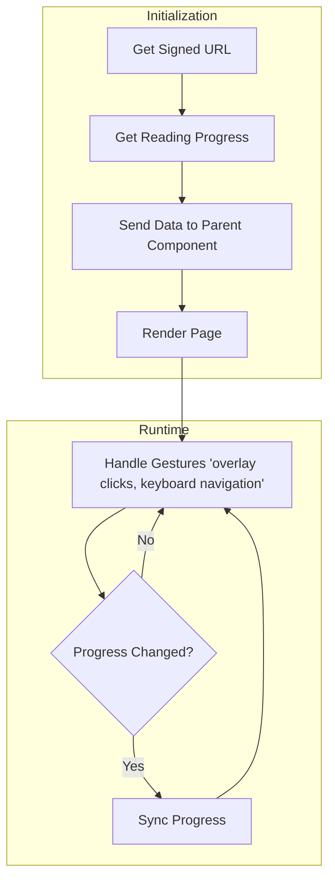

# PDF Rendering

This doc explains the changes involved in following commits:

[Rendering PDFs and syncing progress](https://github.com/Calcifer077/lumina-reader/tree/f03d1c5775f7fb6623fc953c2661b6190b76c1e5)

## Introduction

We fetched signed url from supabase of our pdf and rendered it using `react-pdf`. Than we have used route handlers (will remove them in next commit) to sync progress for reading history.

## Getting Data for view

### Create signed URL

We will send a link to our frontend, our frontend will fetch that link and render the pdf.

As our supabase bucket is private, we can't directly access the files, we have to create something called a signed url. Signed url will be created by supabase and comes with a expiration time.

```ts
// _lib/books
export async function getSignedUrlForBook(id: string): Promise<string | null> {
  const [data] = await db
    .select({ filePath: books.file_path })
    .from(books)
    .where(eq(books.id, id));

  const filePath = data.filePath;

  const { data: dataFromStorage, error } = await supabase.storage
    .from("books")
    .createSignedUrl(filePath, 60 * 60); // expire in 1 hour

  if (error) return null;

  return dataFromStorage?.signedUrl;
}
```

### Get progress

Get progress for book.

```ts
// _lib/progress
export async function getProgress(bookId: string): Promise<ReadingProgress> {
  const [data] = await db
    .select()
    .from(readingProgress)
    .where(eq(readingProgress.book_id, bookId));

  return data;
}
```

If the data is not present (user never read the book), `data` will be null which is handled in frontend.

## Sending data to the viewer

This page is a server component, so we can just fetch data at the top level component.

```tsx
// _app/reader/[bookId]
import PdfViewer from "@/app/_components/reader/PdfViewer";
import { getSignedUrlForBook } from "@/app/_lib/books";
import { getProgress } from "@/app/_lib/progress";

// get params from url
type Props = {
  params: Promise<{ bookId: string }>;
};

export default async function ReaderPage({ params }: Props) {
  const { bookId } = await params;

  const bookUrl = await getSignedUrlForBook(bookId);
  const progress = await getProgress(bookId);

  // can't find the url, we also have a 'not-found' page at this layout.
  if (bookUrl === null) return null;

  return (
    <div className="max-w-7xl mx-auto px-4">
      <div>
        <PdfViewer
          bookUrl={bookUrl}
          bookId={bookId}
          // If the user never read it, we will start from the first page
          initialPage={progress ? Number(progress.location) : 1}
        />
      </div>
    </div>
  );
}
```

## Rendering PDF

We have used `react-pdf` for rendering.

### Showing user the pdf

```tsx
"use client";

import React, {
  type ChangeEvent,
  useCallback,
  useEffect,
  useRef,
  useState,
} from "react";
import { Document, Page, pdfjs } from "react-pdf";
import "react-pdf/dist/Page/AnnotationLayer.css";
import "react-pdf/dist/Page/TextLayer.css";

import { AnimatePresence, motion } from "motion/react";
import { toast } from "sonner";

import { useKeyPress } from "@/app/_lib/hooks/useKeyPress";
import useLocalStorage from "@/app/_lib/hooks/useLocalStorage";
import { Button } from "@/components/ui/button";

pdfjs.GlobalWorkerOptions.workerSrc = `https://unpkg.com/pdfjs-dist@${pdfjs.version}/build/pdf.worker.min.mjs`;

function highlightPattern(text: string, pattern: string) {
  return text.replace(pattern, (value) => `<mark>${value}</mark>`);
}

interface PdfViewerProps {
  bookUrl: string;
  bookId: string;
  initialPage: number;
}

export default function PdfViewer({
  bookUrl,
  bookId,
  initialPage = 1,
}: PdfViewerProps) {
  const [numPages, setNumPages] = useState<number | null>(null);
  const [pageNumber, setPageNumber] = useState(initialPage);
  const [zoomLevel, setZoomLevel] = useLocalStorage("pdf-zoom-level", 1);
  const [searchText, setSearchText] = useState<string>("");
  const [pageWidth, setPageWidth] = useState<number>(800);
  const [direction, setDirection] = useState(0);
  const [useIFrame, setUseIFrame] = useState(false);
  const [IFrameUsageConfirmation, setIFrameUsageConfirmation] = useState(false);

  const [error, setError] = useState<string | null>(null);
  const [isSaving, setIsSaving] = useState(false);
  const lastSavedPage = useRef(initialPage);

  useEffect(() => {
    const updateWidth = () => {
      const width = Math.min(window.innerWidth - 32, 900);
      setPageWidth(width);
    };

    updateWidth();
    window.addEventListener("resize", updateWidth);
    return () => window.removeEventListener("resize", updateWidth);
  }, []);

    setUseIFrame((prev) => !prev);
    setIFrameUsageConfirmation(false);
  }

  function onBookLoadSuccess({ numPages }: { numPages: number }): void {
    setNumPages(numPages);
  }

  function onBookLoadError(err: Error): void {
    console.error("Failed to load PDF. ", err);
    setError("Failed to load PDF. Please try again.");
  }

  function goToPrevPage(): void {
    if (pageNumber > 1) {
      setDirection(-1);
      setPageNumber((p) => p - 1);
    }
  }

  function goToNextPage(): void {
    if (!numPages || pageNumber < numPages) {
      setDirection(1);
      setPageNumber((p) => p + 1);
    }
  }

  function zoomPos(): void {
    setZoomLevel((z) => Math.min(Number((z + 0.1).toFixed(2)), 3));
  }

  function zoomNeg(): void {
    setZoomLevel((z) => Math.max(Number((z - 0.1).toFixed(2)), 0.2));
  }

  useKeyPress("ArrowLeft", goToPrevPage, true);
  useKeyPress("ArrowRight", goToNextPage, true);

  if (!useIFrame) {
    return (
      <div className="flex h-dvh flex-col overflow-hidden bg-background relative">
        {/* 1. Added relative and overflow-hidden here to contain sliding pages */}
        {/* Replace the middle section inside PdfViewer */}
        <div className="flex-1 overflow-hidden relative bg-muted p-4 flex items-center justify-center w-full">
          <Document
            file={bookUrl}
            onLoadSuccess={onBookLoadSuccess}
            onLoadError={onBookLoadError}
            loading={
              <p className="text-body-md text-on-surface-variant font-body py-8 m-auto">
                Loading PDF…
              </p>
            }
            className="relative flex items-center justify-center w-full h-full overflow-hidden"
          >
            <div
              className="absolute inset-0 z-0 pointer-events-auto cursor-pointer overflow-hidden flex items-center justify-center"
            >
                <div
                  key={pageNumber}
                  className="absolute max-w-full max-h-full overflow-auto shadow-xl"
                >
                  <Page
                    pageNumber={pageNumber}
                    customTextRenderer={textRenderer}
                    width={pageWidth}
                    scale={zoomLevel}
                  />
                </div>
            </div>
          </Document>
        </div>
  } else {
    return (
      <div className="flex h-screen flex-col bg-background relative">
        <iframe src={bookUrl} className="h-full w-full"></iframe>
      </div>
    );
  }
}
```

_Note: Above is not the complete component, just the parts which are required for rendering._

_Note: We have used a local storage hook above which stores data for the user like zoom levels for pdfs, background colour, text colour, font size for epub. This hook docs are also available in its file._

We have successfully rendered pdf, now we need to sync progress.

Initial progress is given to us by the parent component itself we need to sync changing progress.

We will track `pageNumber` and do a api call every time there is change in it.

```tsx
// If the user clicks more than one time in 1 sec, previous clicks will be cancelled (debounce)
useEffect(() => {
  if (lastSavedPage.current === pageNumber) return;

  const timeout = setTimeout(async () => {
    try {
      setIsSaving(true);
      setError("");

      const res = await fetch(`/api/progress/${bookId}`, {
        method: "POST",
        headers: {
          "Content-Type": "application/json",
        },
        body: JSON.stringify({
          location: pageNumber.toString(),
        }),
      });

      const data = await res.json();

      if (!res.ok || !data.success) {
        setError("There was a problem while syncing.");
        return;
      }

      lastSavedPage.current = pageNumber;
    } catch (err) {
      console.error(err);
      setError("There was a problem while syncing.");
    } finally {
      setIsSaving(false);
    }
  }, 1000); // Wait 1 second after the last page change

  return () => clearTimeout(timeout);
}, [pageNumber, bookId]);
```

This effect also does debouncing, if the user clicks more than one key in a single second, only the last key will be considered, and there will be no api call for rest of the clicks.

The feedback for syncing of progress is shown using icons in the top right. We have used tooltip instead of toasts to show status to the user. As tooltip don't work in mobile, user can access details by clicking on the icons.

There's some animation which are also involved (powered by motion).

```tsx
const variants = {
  enter: (direction: number) => ({
    x: direction > 0 ? "100%" : "-100%",
    opacity: 0,
  }),
  center: {
    x: 0,
    zIndex: 1,
    opacity: 1,
  },
  exit: (direction: number) => ({
    x: direction < 0 ? "100%" : "-100%",
    opacity: 0,
  }),
};

// Inside component:
<AnimatePresence initial={false} custom={direction}>
  <motion.div
    key={pageNumber}
    custom={direction}
    variants={variants}
    initial="enter"
    animate="center"
    exit="exit"
    transition={{ opacity: { duration: 0.1 } }}
    className="absolute max-w-full max-h-full overflow-auto shadow-xl"
  >
    <Page
      pageNumber={pageNumber}
      customTextRenderer={textRenderer}
      width={pageWidth}
      scale={zoomLevel}
    />
  </motion.div>
</AnimatePresence>;
```

As a fallback, option for iframe is also given to the user.

_Note: As of now there is no way to get progress when using iframe._

### Route for handling syncing progress

_Note: It will be converted to a internal api call in latest changes. (will update here)_

```ts
// This route will handle both get progress and save progress
import { NextRequest, NextResponse } from "next/server";

import type { ReadingProgress } from "@/app/_db/schema";
import { saveProgress } from "@/app/_lib/progress";
import type { ApiResponse } from "@/app/_lib/types";

interface SaveProgressBody {
  location: string;
}

function isSaveProgressBody(value: unknown): value is SaveProgressBody {
  return typeof value === "object" && value !== null && "location" in value;
}

export async function POST(
  req: NextRequest,
  { params }: RouteParams,
): Promise<NextResponse<ApiResponse<ReadingProgress>>> {
  const { bookId } = await params;

  const body = await req.json();

  if (!isSaveProgressBody(body)) {
    return NextResponse.json(
      { success: false, error: "Expected {location: string}" },
      { status: 400 },
    );
  }

  const res = await saveProgress(bookId, body.location);

  return NextResponse.json({ success: true, data: res });
  try {
  } catch (err) {
    console.error("POST /api/progress/[bookId] failed:", err);
    return NextResponse.json(
      { success: false, error: "Failed to save progress" },
      { status: 500 },
    );
  }
}
```

data layer responsible for mutation.

```ts
export async function saveProgress(
  bookId: string,
  location: string,
): Promise<ReadingProgress> {
  const [data] = await db
    .select()
    .from(readingProgress)
    .where(eq(readingProgress.book_id, bookId));

  // progress doesn't exist, create one
  if (!data) {
    const [res] = await db
      .insert(readingProgress)
      .values({ book_id: bookId, location: location });

    return res;

    // progress does exist, update it
  } else {
    const [res] = await db
      .update(readingProgress)
      .set({ location: location })
      .where(eq(readingProgress.book_id, bookId));

    return res;
  }
}
```

## Overview

```
Get signed url and get progress -> send data to parent component -> render page with given data -> handle gestures (overlay clicks, keyboard navigation) -> in case of any progress change handle sync
```



Further reading:
[Server actions](https://github.com/Calcifer077/obsidian-notes/blob/main/Nextjs/Learning%20path%20from%20Docs/Mutating%20Data/Mutating%20Data.md)
[Routes in nextjs](https://github.com/Calcifer077/obsidian-notes/blob/main/Nextjs/File%20System%20Conventions/Route.js.md)
[React PDF](https://github.com/wojtekmaj/react-pdf)
