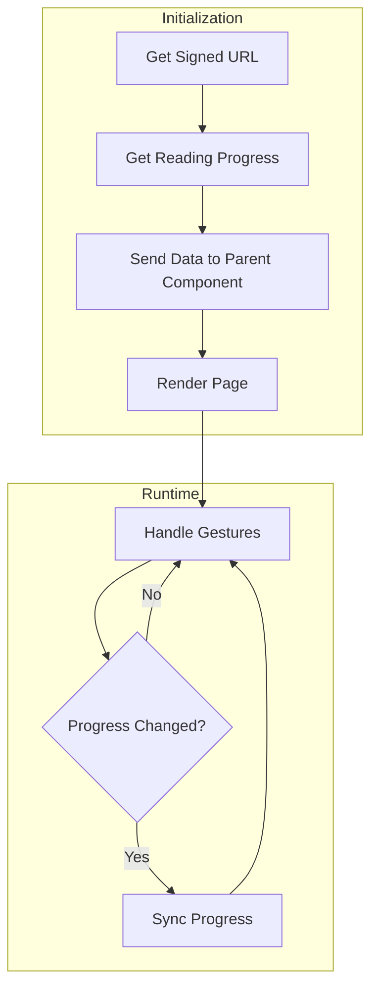

# PDF Rendering

This doc explains the changes involved in following commits:

[Rendering PDFs](https://github.com/Calcifer077/lumina-reader/tree/becf6b2dca50a2c5e514aceb8a566488b1c00dc6)
[Syncing progress](https://github.com/Calcifer077/lumina-reader/tree/d29e5985506e88a7836659d5c5f6af80a7bd0d01)

## Introduction

We fetched signed url from supabase of our pdf and rendered it using `react-pdf`. Than we have used route handlers (will remove them in next commit) to sync progress for reading history.

## Getting Data for view

### Create signed URL

We will send a link to our frontend, our frontend will fetch that link and render the pdf.

As our supabase bucket is private, we can't directly access the files, we have to create something called a signed url. Signed url will be created by supabase and comes with a expiration time.

```ts
// _lib/books
export async function getSignedUrlForBook(id: string): Promise<string | null> {
  const [data] = await db
    .select({ filePath: books.file_path })
    .from(books)
    .where(eq(books.id, id));

  const filePath = data.filePath;

  const { data: dataFromStorage, error } = await supabase.storage
    .from("books")
    .createSignedUrl(filePath, 60 * 60); // expire in 1 hour

  if (error) return null;

  return dataFromStorage?.signedUrl;
}
```

### Get progress

Get progress for book.

```ts
// _lib/progress
export async function getProgress(bookId: string): Promise<ReadingProgress> {
  const [data] = await db
    .select()
    .from(readingProgress)
    .where(eq(readingProgress.book_id, bookId));

  return data;
}
```

If the data is not present (user never read the book), `data` will be null which is handled in frontend.

## Sending data to the viewer

This page is a server component, so we can just fetch data at the top level component.

```tsx
// _app/reader/[bookId]
import PdfViewer from "@/app/_components/reader/PdfViewer";
import { getSignedUrlForBook } from "@/app/_lib/books";
import { getProgress } from "@/app/_lib/progress";

// get params from url
type Props = {
  params: Promise<{ bookId: string }>;
};

export default async function ReaderPage({ params }: Props) {
  const { bookId } = await params;

  const bookUrl = await getSignedUrlForBook(bookId);
  const progress = await getProgress(bookId);

  // can't find the url, we also have a 'not-found' page at this layout.
  if (bookUrl === null) return null;

  return (
    <div className="max-w-7xl mx-auto px-4">
      <div>
        <PdfViewer
          bookUrl={bookUrl}
          bookId={bookId}
          // If the user never read it, we will start from the first page
          initialPage={progress ? Number(progress.location) : 1}
        />
      </div>
    </div>
  );
}
```

## Rendering PDF

We have used `react-pdf` for rendering and `@use-gesture/react` for handling gestures.

### Handling gestures

The main gestures we have used is the `pinch` applicable in zooming. `onDrag` works for mobile. For pc users, I have used keyboard shortcuts.

```tsx
const viewerRef = useRef<HTMLDivElement>(null);

useGesture(
  {
    onPinch: ({ offset: [d] }) => {
      const newScale = Math.min(MAX_SCALE, Math.max(MIN_SCALE, d));

      setVisualScale(newScale);
    },

    onPinchEnd: () => {
      setScale(visualScale);
    },

    onDragEnd: ({ movement: [mx], direction: [dx], tap, pinching }) => {
      if (tap || pinching) return;

      if (scale >= 1) return;

      if (Math.abs(mx) < MIN_SWIPE_DISTANCE) return;

      if (dx < 0) {
        // Swipe left -> Next page
        setPageNumber((p) => Math.min(numPages ?? p, p + 1));
      } else {
        // Swipe right -> Previous page
        setPageNumber((p) => Math.max(1, p - 1));
      }
    },
  },
  {
    target: viewerRef,
    eventOptions: {
      passive: false,
    },
    pinch: {
      scaleBounds: {
        min: MIN_SCALE,
        max: MAX_SCALE,
      },
      rubberband: true,
      from: () => [scale, 0],
    },
    drag: {
      filterTaps: true,
      pointer: {
        touch: true,
        mouse: true,
      },
    },
  },
);
```

Keyboard events are handled by `useKeyPress` hook defined under `_lib/hooks`. [](https://github.com/Calcifer077/lumina-reader/blob/main/src/app/_lib/hooks/useKeyPress.ts)

In our component:

```tsx
useKeyPress("ArrowLeft", goToPrevPage, true);
useKeyPress("ArrowRight", goToNextPage, true);
```

### Showing user the pdf

```tsx
"use client";

import { useState, useEffect, useRef } from "react";
import { Document, Page, pdfjs } from "react-pdf";
import "react-pdf/dist/Page/AnnotationLayer.css";
import "react-pdf/dist/Page/TextLayer.css";

pdfjs.GlobalWorkerOptions.workerSrc = `https://unpkg.com/pdfjs-dist@${pdfjs.version}/build/pdf.worker.min.mjs`;

const MIN_SCALE = 0.5;
const MAX_SCALE = 3;
const SCALE_STEP = 0.25;
const MIN_SWIPE_DISTANCE = 5;

interface PdfViewerProps {
  bookUrl: string;
  bookId: string;
  initialPage: number;
}

export default function PdfViewer({
  bookUrl,
  bookId,
  initialPage = 1,
}: PdfViewerProps) {
  const [numPages, setNumPages] = useState<number | null>(null);
  const [pageNumber, setPageNumber] = useState(initialPage);
  const [scale, setScale] = useState(1); // Actual PDF render scale
  const [visualScale, setVisualScale] = useState(1); // CSS tranform during pinch
  const [saving, setSaving] = useState(false);
  const [syncError, setSyncError] = useState("");
  const [error, setError] = useState<string | null>(null);
  const lastSavedPage = useRef(initialPage);

  const viewerRef = useRef<HTMLDivElement>(null);

  function onBookLoadSuccess({ numPages }: { numPages: number }) {
    setNumPages(numPages);
  }

  function onBookLoadError(err: Error): void {
    console.error("Failed to load PDF. ", err);
    setError("Failed to load PDF. Please try again.");
  }

  const goToPrevPage = () => setPageNumber((p) => Math.max(1, p - 1));
  const goToNextPage = () =>
    setPageNumber((p) => Math.min(numPages || p, p + 1));

  const zoomIn = () =>
    setScale((s) => Math.min(MAX_SCALE, +(s + SCALE_STEP).toFixed(2)));
  const zoomOut = () =>
    setScale((s) => Math.max(MIN_SCALE, +(s - SCALE_STEP).toFixed(2)));
  const resetZoom = () => setScale(1);

  return (
    <div className="flex flex-col items-center gap-4">
      {/* Toolbar */}
      <div className="flex flex-col md:flex-row items-center gap-4 md:sticky top-0 z-999 py-2 px-4 border-b border-border bg-surface/95 backdrop-blur-sm w-full justify-center rounded-b-lg touch-none">
        <div className="flex items-center gap-2">
          <button
            onClick={goToPrevPage}
            disabled={pageNumber <= 1}
            className="px-3 py-1.5 rounded-md border border-border bg-surface-low text-on-surface text-label-sm font-label
                     hover:bg-surface-high transition-colors
                     disabled:opacity-40 disabled:hover:bg-surface-low"
          >
            ← Prev
          </button>

          <span className="text-body-sm text-on-surface-variant font-body tabular-nums">
            Page {pageNumber} of {numPages || "..."}
          </span>

          <button
            onClick={goToNextPage}
            disabled={pageNumber >= (numPages || 1)}
            className="px-3 py-1.5 rounded-md border border-border bg-surface-low text-on-surface text-label-sm font-label
                     hover:bg-surface-high transition-colors
                     disabled:opacity-40 disabled:hover:bg-surface-low"
          >
            Next →
          </button>
        </div>

        <div className="flex items-center gap-2 border-l border-border pl-4">
          <button
            onClick={zoomOut}
            disabled={scale <= MIN_SCALE}
            className="w-7 h-7 flex items-center justify-center rounded-md border border-border bg-surface-low text-on-surface
                     hover:bg-surface-high transition-colors
                     disabled:opacity-40 disabled:hover:bg-surface-low"
          >
            −
          </button>

          <span className="text-body-sm text-on-surface-variant font-body w-12 text-center tabular-nums">
            {Math.round(scale * 100)}%
          </span>

          <button
            onClick={zoomIn}
            disabled={scale >= MAX_SCALE}
            className="w-7 h-7 flex items-center justify-center rounded-md border border-border bg-surface-low text-on-surface
                     hover:bg-surface-high transition-colors
                     disabled:opacity-40 disabled:hover:bg-surface-low"
          >
            +
          </button>

          <button
            onClick={resetZoom}
            className="px-2.5 py-1 rounded-md text-label-sm font-label text-primary
                     hover:bg-primary-container/10 transition-colors"
          >
            Reset
          </button>
        </div>

        {saving && (
          <span className="absolute right-2 text-label-sm text-on-surface-variant/70 font-label animate-pulse">
            Saving progress…
          </span>
        )}

        {syncError && (
          <span className="text-label-sm text-red-900 font-label animate-pulse">
            {syncError}
          </span>
        )}
      </div>

      {/* PDF Page */}
      <div
        ref={viewerRef}
        className="overflow-auto w-screen flex items-center justify-center rounded-lg bg-surface-container-lowest shadow-sm border border-border p-4"
      >
        <Document
          file={bookUrl}
          onLoadSuccess={onBookLoadSuccess}
          onLoadError={onBookLoadError}
          loading={
            <p className="text-body-md text-on-surface-variant font-body py-8">
              Loading PDF…
            </p>
          }
        >
          <div
            style={{
              transform: `scale(${visualScale / scale})`,
              transformOrigin: "center center",
            }}
          >
            <Page
              pageNumber={pageNumber}
              scale={scale}
              className="shadow-md transition-transform duration-150"
            />
          </div>
        </Document>
      </div>
    </div>
  );
}
```

_Note: Above is not the complete component, just the parts which are required for rendering._

We have successfully rendered pdf, now we need to sync progress.

Initial progress is given to us by the parent component itself we need to sync changing progress.

We will track `pageNumber` and do a api call every time there is change in it.

```tsx
useEffect(() => {
  if (lastSavedPage.current === pageNumber) return;

  const timeout = setTimeout(async () => {
    try {
      setSaving(true);
      setSyncError("");

      const res = await fetch(`/api/progress/${bookId}`, {
        method: "POST",
        headers: {
          "Content-Type": "application/json",
        },
        body: JSON.stringify({
          location: pageNumber.toString(),
        }),
      });

      const data = await res.json();

      if (!res.ok || !data.success) {
        setSyncError("There was a problem while syncing.");
        return;
      }

      lastSavedPage.current = pageNumber;
    } catch (err) {
      console.error(err);
      setSyncError("There was a problem while syncing.");
    } finally {
      setSaving(false);
    }
  }, 1000); // Wait 1 second after the last page change

  return () => clearTimeout(timeout);
}, [pageNumber, bookId]);
```

This effect also does debouncing, if the user clicks more than one key in a single second, only the last key will be considered, and there will be no api call for rest of the clicks.

### Route for handling syncing progress

_Note: It will be converted to a internal api call in latest changes. (will update here)_

```ts
// This route will handle both get progress and save progress

import { NextRequest, NextResponse } from "next/server";
import type { ApiResponse } from "@/app/_lib/types";
import type { ReadingProgress } from "@/app/_db/schema";

import { saveProgress } from "@/app/_lib/progress";

interface SaveProgressBody {
  location: string;
}

function isSaveProgressBody(value: unknown): value is SaveProgressBody {
  return typeof value === "object" && value !== null && "location" in value;
}

export async function POST(
  req: NextRequest,
  { params }: RouteParams,
): Promise<NextResponse<ApiResponse<ReadingProgress>>> {
  const { bookId } = await params;

  const body = await req.json();

  if (!isSaveProgressBody(body)) {
    return NextResponse.json(
      { success: false, error: "Expected {location: string}" },
      { status: 400 },
    );
  }

  const res = await saveProgress(bookId, body.location);

  return NextResponse.json({ success: true, data: res });
  try {
  } catch (err) {
    console.error("POST /api/progress/[bookId] failed:", err);
    return NextResponse.json(
      { success: false, error: "Failed to save progress" },
      { status: 500 },
    );
  }
}
```

data layer responsible for mutation.

```ts
export async function saveProgress(
  bookId: string,
  location: string,
): Promise<ReadingProgress> {
  const [data] = await db
    .select()
    .from(readingProgress)
    .where(eq(readingProgress.book_id, bookId));

  // progress doesn't exist, create one
  if (!data) {
    const [res] = await db
      .insert(readingProgress)
      .values({ book_id: bookId, location: location });

    return res;

    // progress does exist, update it
  } else {
    const [res] = await db
      .update(readingProgress)
      .set({ location: location })
      .where(eq(readingProgress.book_id, bookId));

    return res;
  }
}
```

## Overview

```
Get signed url and get progress -> send data to parent component -> render page with given data -> handle gestures -> in case of any progress change handle sync
```



Further reading:
[Server actions](https://github.com/Calcifer077/obsidian-notes/blob/main/Nextjs/Learning%20path%20from%20Docs/Mutating%20Data/Mutating%20Data.md)
[Routes in nextjs](https://github.com/Calcifer077/obsidian-notes/blob/main/Nextjs/File%20System%20Conventions/Route.js.md)
